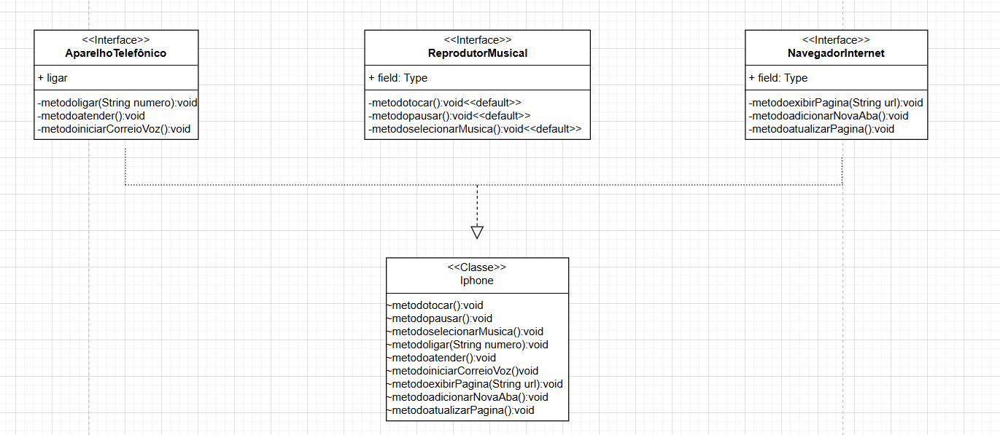

# 📝 UML de Interfaces e Implementação de Classe

## 📌 Descrição  
Este projeto consiste na **implementação de um diagrama UML** criado por mim, que contém **três interfaces** e uma **classe** que implementa essas interfaces. O objetivo foi praticar a modelagem com UML e a codificação em **Java**, aplicando conceitos de **abstração e implementação de interfaces**.

## 📦 Estrutura do Diagrama UML  

O diagrama abaixo foi criado para representar a relação entre as interfaces e a classe implementadora:

> 🔹 *O diagrama UML acima foi desenvolvido por mim antes da implementação do código.*

## 🚀 Tecnologias Utilizadas  
- **Java**
- **UML**
